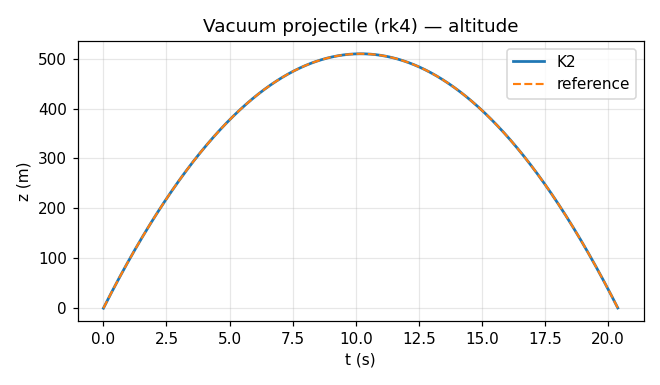
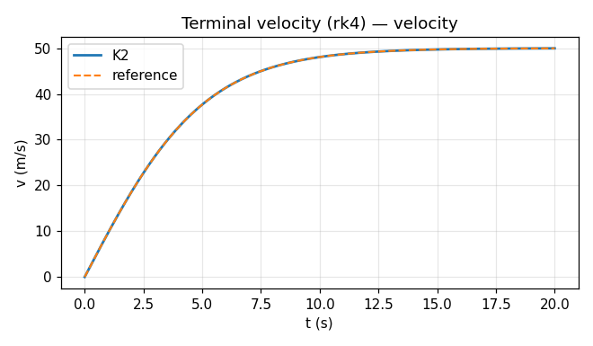
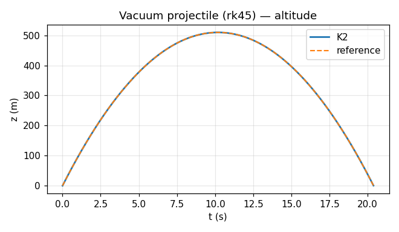
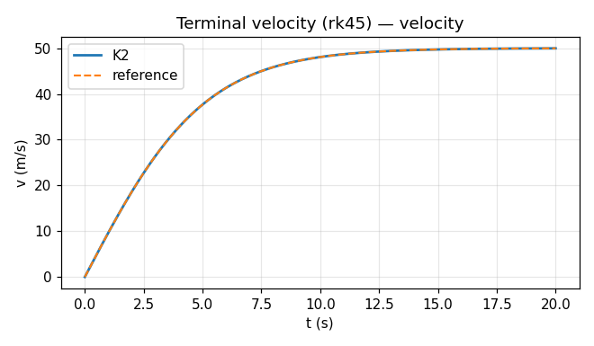
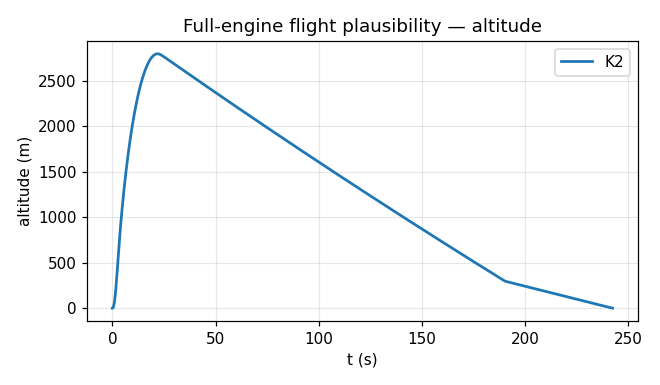

# K2 Physics Validation Report

_Generated 2026-06-09 16:50 UTC_

**14 passed · 0 failed · 1 skipped**

Each engine is benchmarked against an *independent* reference: the 6DOF integrator against exact ODE solutions, aerodynamics against the Taylor–Maccoll exact cone solution and SU2, and structures against textbook closed form and CalculiX.

## Flight Simulation (6DOF) ↔ Integrator exact solutions / OpenRocket

### PASS — Vacuum projectile (rk4)

_Reference:_ Exact kinematics z=v0·t−½g·t² &nbsp;|&nbsp; _Credibility:_ Validated

| Quantity | K2 | Reference | Source | Rel. err | Tol | Status |
|---|---|---|---|---|---|---|
| Apogee height | 509.9 | 509.9 | v0²/2g | 0.00% | 0% | |
| Position RMSE vs parabola | 1.492e-11 | 0 | exact | 0.00% |  / 0.05 | |

### PASS — Terminal velocity (rk4)

_Reference:_ Exact v(t)=v_t·tanh(g·t/v_t), v_t=√(g/k) &nbsp;|&nbsp; _Credibility:_ Validated

| Quantity | K2 | Reference | Source | Rel. err | Tol | Status |
|---|---|---|---|---|---|---|
| Terminal velocity | 49.96 | 50 | √(g/k) | 0.08% | 0% | |
| Velocity RMSE vs tanh | 5.968e-12 | 0 | exact | 0.00% |  / 0.02 | |

### PASS — Oscillator energy (rk4)

_Reference:_ Conserved E=½v²+½ω²x² over 50 periods &nbsp;|&nbsp; _Credibility:_ Validated

| Quantity | K2 | Reference | Source | Rel. err | Tol | Status |
|---|---|---|---|---|---|---|
| Energy drift (50 periods) | 2 | 2 | E(0) | 0.00% | 1% | |

### PASS — Vacuum projectile (rk45)

_Reference:_ Exact kinematics z=v0·t−½g·t² &nbsp;|&nbsp; _Credibility:_ Validated

| Quantity | K2 | Reference | Source | Rel. err | Tol | Status |
|---|---|---|---|---|---|---|
| Apogee height | 509.9 | 509.9 | v0²/2g | 0.00% | 0% | |
| Position RMSE vs parabola | 1.493e-11 | 0 | exact | 0.00% |  / 0.05 | |

### PASS — Terminal velocity (rk45)

_Reference:_ Exact v(t)=v_t·tanh(g·t/v_t), v_t=√(g/k) &nbsp;|&nbsp; _Credibility:_ Validated

| Quantity | K2 | Reference | Source | Rel. err | Tol | Status |
|---|---|---|---|---|---|---|
| Terminal velocity | 49.96 | 50 | √(g/k) | 0.08% | 0% | |
| Velocity RMSE vs tanh | 5.015e-13 | 0 | exact | 0.00% |  / 0.02 | |

### PASS — Oscillator energy (rk45)

_Reference:_ Conserved E=½v²+½ω²x² over 50 periods &nbsp;|&nbsp; _Credibility:_ Validated

| Quantity | K2 | Reference | Source | Rel. err | Tol | Status |
|---|---|---|---|---|---|---|
| Energy drift (50 periods) | 2 | 2 | E(0) | 0.00% | 1% | |

### PASS — Full-engine flight plausibility

_Reference:_ Physical sanity bounds (canonical L1090W rocket) &nbsp;|&nbsp; _Credibility:_ Estimated

| Quantity | K2 | Reference | Source | Rel. err | Tol | Status |
|---|---|---|---|---|---|---|
| Apogee in [500, 6000] m | 1 | 1 | bound | 0.00% |  / 0.5 | |
| Vehicle landed | 1 | 1 | bound | 0.00% |  / 0.5 | |
| Max-Q before apogee | 1 | 1 | bound | 0.00% |  / 0.5 | |
| Subsonic-to-low-supersonic max Mach | 1 | 1 | bound | 0.00% |  / 0.5 | |

### Sim vs OpenRocket  *(skipped)*

_Reference:_ OpenRocket flight CSV (canonical rocket)  
_Reason:_ set OPENROCKET_CSV to an OpenRocket flight-data CSV of the canonical rocket (build it per validation/cases/rocket_canonical.py, motor L1090W, and export flight data)

## Aerodynamics ↔ Taylor–Maccoll exact / SU2

### PASS — Taylor–Maccoll cone vs NACA-1135

_Reference:_ NACA Report 1135 cone tables &nbsp;|&nbsp; _Credibility:_ Validated

| Quantity | K2 | Reference | Source | Rel. err | Tol | Status |
|---|---|---|---|---|---|---|
| Shock angle (M=2.0, θc=10.0°) | 31.21 | 31.2 | NACA-1135 | 0.02% | 1% | |
| Surface Cp (M=2.0, θc=10.0°) | 0.1045 | 0.105 | NACA-1135 | 0.50% | 5% | |
| Shock angle (M=3.0, θc=10.0°) | 21.71 | 21.8 | NACA-1135 | 0.39% | 1% | |
| Surface Cp (M=3.0, θc=10.0°) | 0.08748 | 0.088 | NACA-1135 | 0.59% | 5% | |

### PASS — SU2 cone vs Taylor–Maccoll

_Reference:_ Taylor–Maccoll exact (M=2, 10° cone) &nbsp;|&nbsp; _Credibility:_ Validated

| Quantity | K2 | Reference | Source | Rel. err | Tol | Status |
|---|---|---|---|---|---|---|
| Cone surface Cp (M=2, 10°) | 0.1007 | 0.1045 | Taylor–Maccoll | 3.59% | 10% | |

### PASS — Barrowman aero vs SU2

_Reference:_ SU2 RANS (canonical rocket) &nbsp;|&nbsp; _Credibility:_ Estimated

| Quantity | K2 | Reference | Source | Rel. err | Tol | Status |
|---|---|---|---|---|---|---|
| CFD reference area | 0.008171 | 0.008171 | π·(d_body/2)² | 0.00% | 2% | |
| Drag positive | 1 | 1 | sign | 0.00% |  / 0.5 | |
| Lift positive at +AoA | 1 | 1 | sign | 0.00% |  / 0.5 | |
| Drag coefficient Cd (diagnostic) | 0.2552 | 0.7226 | SU2 | 64.68% | 100% | |
| Normal-force Cn vs SU2 Cl (diagnostic) | 0.9122 | 3.038 | SU2 (Cl) | 69.98% | 100% | |

## Structures ↔ Textbook closed form / CalculiX

### PASS — Closed-form structural formulas

_Reference:_ Textbook thin-wall / Euler relations &nbsp;|&nbsp; _Credibility:_ Validated

| Quantity | K2 | Reference | Source | Rel. err | Tol | Status |
|---|---|---|---|---|---|---|
| Hoop stress σ_h | 4e+07 | 4e+07 | p·r/t | 0.00% | 2% | |
| Euler buckling P_cr | 2.752e+05 | 2.752e+05 | π²EI/L² | 0.00% | 5% | |
| von Mises (uniaxial) | 1.5e+08 | 1.5e+08 | σ | 0.00% | 0% | |

### PASS — Uniaxial bar (CalculiX)

_Reference:_ Exact δ=FL/EA, σ=F/A &nbsp;|&nbsp; _Credibility:_ Validated

| Quantity | K2 | Reference | Source | Rel. err | Tol | Status |
|---|---|---|---|---|---|---|
| Tip elongation δ | 1.797e-05 | 1.814e-05 | FL/EA | 0.95% | 3% | |
| Axial stress σ (mean) | 2.5e+06 | 2.5e+06 | F/A | 0.00% | 2% | |

### PASS — Cantilever bending (CalculiX)

_Reference:_ Euler–Bernoulli δ=FL³/3EI &nbsp;|&nbsp; _Credibility:_ Validated

| Quantity | K2 | Reference | Source | Rel. err | Tol | Status |
|---|---|---|---|---|---|---|
| Tip deflection δ | 0.002242 | 0.002268 | FL³/3EI | 1.11% | 5% | |

### PASS — 1st bending mode: closed-form vs CalculiX

_Reference:_ CalculiX modal (cantilever) &nbsp;|&nbsp; _Credibility:_ Estimated

| Quantity | K2 | Reference | Source | Rel. err | Tol | Status |
|---|---|---|---|---|---|---|
| f1 (1st lateral bending) | 25.81 | 25.78 | CalculiX mode 1 | 0.11% | 25% | |

