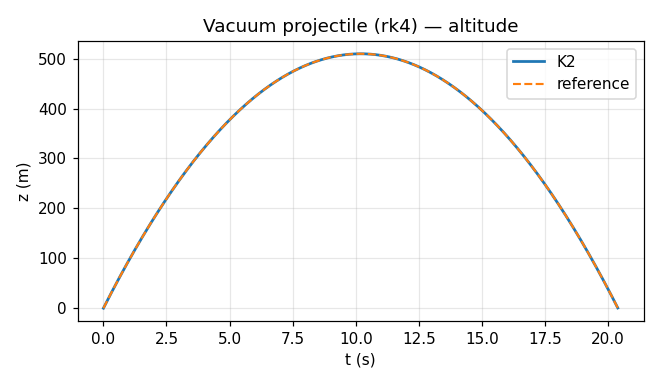
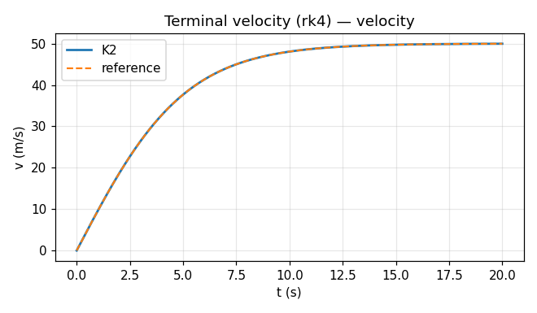
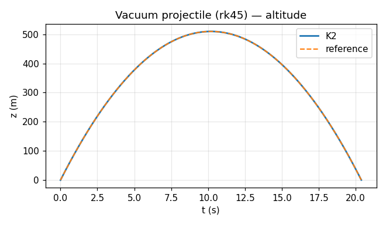
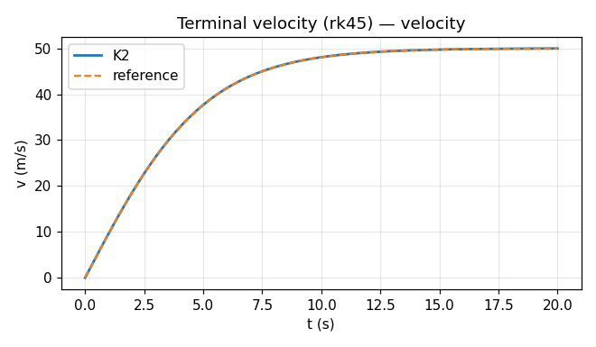
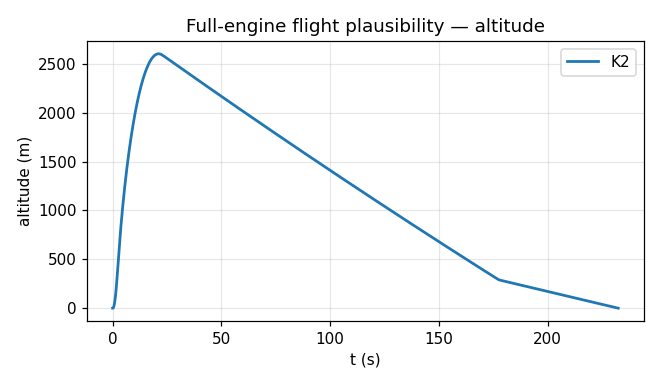
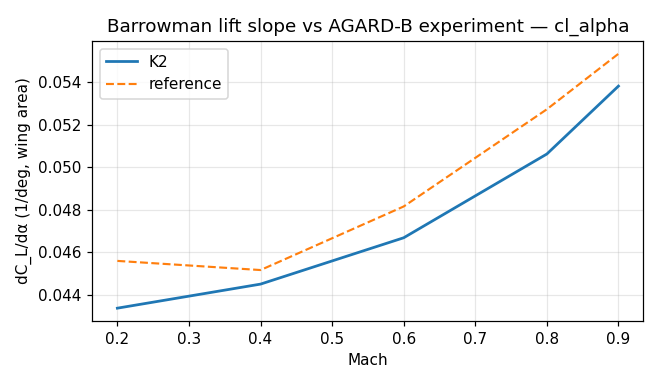
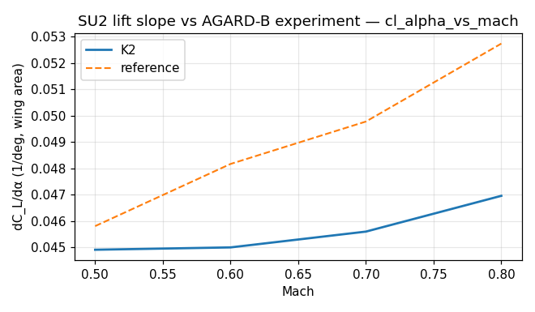
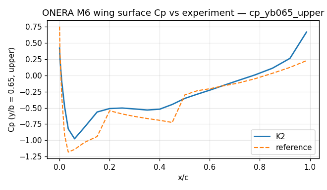

# K2 Physics Validation Report

_Generated 2026-08-13 11:02 UTC_

**18 passed · 1 failed · 1 skipped**

Each engine is benchmarked against an *independent* reference, in three tiers of increasing strength:

1. **Exact solutions** — the 6DOF integrator against closed-form ODE solutions, structures against textbook formulas, the cone solver against Taylor–Maccoll.
2. **Code-to-code** — flight against OpenRocket, aerodynamics against SU2, the airframe FEM against CalculiX.
3. **Published measurement** — 3 benchmarks compare K2 against wind-tunnel data from the open literature. Agreement with another program proves consistency; agreement with a measurement is the only tier that can show the physics is right. The table below lists these alongside the other published references (exact-solution tables, agreed benchmark target values), which are external but are not measurements.

### Comparisons against published data

| Benchmark | Source | Kind | Status |
|---|---|---|---|
| Taylor–Maccoll cone vs NACA-1135 | NACA Report 1135 cone tables | published exact-solution tables | PASS |
| Barrowman lift slope vs AGARD-B experiment | AEDC-TR-70-100 wind-tunnel data (AGARD-B, Tunnel 4T) | wind-tunnel measurement | PASS |
| SU2 lift slope vs AGARD-B experiment | AEDC-TR-70-100 wind-tunnel data (AGARD-B, Tunnel 4T) | wind-tunnel measurement | PASS |
| ONERA M6 wing surface Cp vs experiment | Schmitt & Charpin, AGARD AR-138 (1979), Test 2308 | wind-tunnel measurement | FAIL |
| NAFEMS LE1 — elliptic membrane (CalculiX) | NAFEMS standard benchmark target value | agreed benchmark target value | PASS |
| NAFEMS LE10 — thick plate under pressure (CalculiX) | NAFEMS standard benchmark target value | agreed benchmark target value | PASS |

## Flight Simulation (6DOF) ↔ Integrator exact solutions / OpenRocket

### PASS — Vacuum projectile (rk4)

_Reference:_ Exact kinematics z=v0·t−½g·t² &nbsp;|&nbsp; _Credibility:_ Validated

| Quantity | K2 | Reference | Source | Rel. err | Tol | Status |
|---|---|---|---|---|---|---|
| Apogee height | 509.9 | 509.9 | v0²/2g | 0.00% | 0% | ✓ |
| Position RMSE vs parabola | 1.492e-11 | 0 | exact | 0.00% |  / 0.05 | ✓ |

### PASS — Terminal velocity (rk4)

_Reference:_ Exact v(t)=v_t·tanh(g·t/v_t), v_t=√(g/k) &nbsp;|&nbsp; _Credibility:_ Validated

| Quantity | K2 | Reference | Source | Rel. err | Tol | Status |
|---|---|---|---|---|---|---|
| Terminal velocity | 49.96 | 50 | √(g/k) | 0.08% | 0% | ✓ |
| Velocity RMSE vs tanh | 5.968e-12 | 0 | exact | 0.00% |  / 0.02 | ✓ |

### PASS — Oscillator energy (rk4)

_Reference:_ Conserved E=½v²+½ω²x² over 50 periods &nbsp;|&nbsp; _Credibility:_ Validated

| Quantity | K2 | Reference | Source | Rel. err | Tol | Status |
|---|---|---|---|---|---|---|
| Energy drift (50 periods) | 2 | 2 | E(0) | 0.00% | 1% | ✓ |

### PASS — Vacuum projectile (rk45)

_Reference:_ Exact kinematics z=v0·t−½g·t² &nbsp;|&nbsp; _Credibility:_ Validated

| Quantity | K2 | Reference | Source | Rel. err | Tol | Status |
|---|---|---|---|---|---|---|
| Apogee height | 509.9 | 509.9 | v0²/2g | 0.00% | 0% | ✓ |
| Position RMSE vs parabola | 1.493e-11 | 0 | exact | 0.00% |  / 0.05 | ✓ |

### PASS — Terminal velocity (rk45)

_Reference:_ Exact v(t)=v_t·tanh(g·t/v_t), v_t=√(g/k) &nbsp;|&nbsp; _Credibility:_ Validated

| Quantity | K2 | Reference | Source | Rel. err | Tol | Status |
|---|---|---|---|---|---|---|
| Terminal velocity | 49.96 | 50 | √(g/k) | 0.08% | 0% | ✓ |
| Velocity RMSE vs tanh | 1.423e-13 | 0 | exact | 0.00% |  / 0.02 | ✓ |

### PASS — Oscillator energy (rk45)

_Reference:_ Conserved E=½v²+½ω²x² over 50 periods &nbsp;|&nbsp; _Credibility:_ Validated

| Quantity | K2 | Reference | Source | Rel. err | Tol | Status |
|---|---|---|---|---|---|---|
| Energy drift (50 periods) | 2 | 2 | E(0) | 0.00% | 1% | ✓ |

### PASS — Full-engine flight plausibility

_Reference:_ Physical sanity bounds (canonical L1090W rocket) &nbsp;|&nbsp; _Credibility:_ Estimated

| Quantity | K2 | Reference | Source | Rel. err | Tol | Status |
|---|---|---|---|---|---|---|
| Apogee in [500, 6000] m | 1 | 1 | bound | 0.00% |  / 0.5 | ✓ |
| Vehicle landed | 1 | 1 | bound | 0.00% |  / 0.5 | ✓ |
| Max-Q before apogee | 1 | 1 | bound | 0.00% |  / 0.5 | ✓ |
| Subsonic-to-low-supersonic max Mach | 1 | 1 | bound | 0.00% |  / 0.5 | ✓ |

### Sim vs OpenRocket  *(skipped)*

_Reference:_ OpenRocket flight CSV (canonical rocket)  
_Reason:_ set OPENROCKET_CSV to an OpenRocket flight-data CSV of the canonical rocket (build it per validation/cases/rocket_canonical.py, motor L1090W, and export flight data)

## Aerodynamics ↔ Wind-tunnel measurement / Taylor–Maccoll exact / SU2

### PASS — Taylor–Maccoll cone vs NACA-1135

_Reference:_ NACA Report 1135 cone tables &nbsp;|&nbsp; _Credibility:_ Validated

| Quantity | K2 | Reference | Source | Rel. err | Tol | Status |
|---|---|---|---|---|---|---|
| Shock angle (M=2.0, θc=10.0°) | 31.21 | 31.2 | NACA-1135 | 0.02% | 1% | ✓ |
| Surface Cp (M=2.0, θc=10.0°) | 0.1045 | 0.105 | NACA-1135 | 0.50% | 5% | ✓ |
| Shock angle (M=3.0, θc=10.0°) | 21.71 | 21.8 | NACA-1135 | 0.39% | 1% | ✓ |
| Surface Cp (M=3.0, θc=10.0°) | 0.08748 | 0.088 | NACA-1135 | 0.59% | 5% | ✓ |

### PASS — Barrowman lift slope vs AGARD-B experiment

_Reference:_ AEDC-TR-70-100 wind-tunnel data (AGARD-B, Tunnel 4T) &nbsp;|&nbsp; _Credibility:_ Estimated

| Quantity | K2 | Reference | Source | Rel. err | Tol | Status |
|---|---|---|---|---|---|---|
| C_Lα(M=0.4) / C_Lα(M=0.2) | 1.018 | 0.9906 | AEDC-TR-70-100 | 2.76% | 8% | ✓ |
| C_Lα(M=0.6) / C_Lα(M=0.2) | 1.052 | 1.056 | AEDC-TR-70-100 | 0.43% | 8% | ✓ |
| C_Lα(M=0.8) / C_Lα(M=0.2) | 1.11 | 1.156 | AEDC-TR-70-100 | 4.05% | 8% | ✓ |
| C_Lα(M=0.9) / C_Lα(M=0.2) | 1.153 | 1.214 | AEDC-TR-70-100 | 4.96% | 8% | ✓ |
| C_Lα at M=0.2 (absolute, diagnostic) | 0.0169 | 0.0456 | AEDC-TR-70-100 | 62.93% | 300% | ✓ |
| C_Lα at M=0.6 (absolute, diagnostic) | 0.01778 | 0.04816 | AEDC-TR-70-100 | 63.09% | 300% | ✓ |
| C_Lα at M=0.9 (absolute, diagnostic) | 0.0195 | 0.05534 | AEDC-TR-70-100 | 64.77% | 300% | ✓ |

### PASS — SU2 cone vs Taylor–Maccoll

_Reference:_ Taylor–Maccoll exact (M=2, 10° cone) &nbsp;|&nbsp; _Credibility:_ Validated

| Quantity | K2 | Reference | Source | Rel. err | Tol | Status |
|---|---|---|---|---|---|---|
| Cone surface Cp (M=2, 10°) | 0.1044 | 0.1045 | Taylor–Maccoll | 0.06% | 10% | ✓ |

### PASS — Barrowman aero vs SU2

_Reference:_ SU2 RANS (canonical rocket) &nbsp;|&nbsp; _Credibility:_ Estimated

| Quantity | K2 | Reference | Source | Rel. err | Tol | Status |
|---|---|---|---|---|---|---|
| CFD reference area | 0.008171 | 0.008171 | π·(d_body/2)² | 0.00% | 2% | ✓ |
| Drag positive | 1 | 1 | sign | 0.00% |  / 0.5 | ✓ |
| Lift positive at +AoA | 1 | 1 | sign | 0.00% |  / 0.5 | ✓ |
| Drag coefficient Cd (diagnostic) | 0.433 | 0.7889 | SU2 | 45.11% | 100% | ✓ |
| Normal-force Cn vs SU2 Cl (diagnostic) | 0.9122 | 3.11 | SU2 (Cl) | 70.67% | 100% | ✓ |

### PASS — SU2 lift slope vs AGARD-B experiment

_Reference:_ AEDC-TR-70-100 wind-tunnel data (AGARD-B, Tunnel 4T) &nbsp;|&nbsp; _Credibility:_ Validated

| Quantity | K2 | Reference | Source | Rel. err | Tol | Status |
|---|---|---|---|---|---|---|
| dC_L/dα at M=0.5 | 0.05065 | 0.0458 | AEDC-TR-70-100 | 10.58% | 15% | ✓ |
| C_L at M=0.5, α=6° | 0.2997 | 0.2761 | AEDC-TR-70-100 | 8.56% | 20% | ✓ |
| dC_L/dα at M=0.6 | 0.04979 | 0.04816 | AEDC-TR-70-100 | 3.39% | 15% | ✓ |
| C_L at M=0.6, α=6° | 0.2947 | 0.2934 | AEDC-TR-70-100 | 0.43% | 20% | ✓ |
| dC_L/dα at M=0.7 | 0.04967 | 0.04977 | AEDC-TR-70-100 | 0.21% | 15% | ✓ |
| C_L at M=0.7, α=6° | 0.2939 | 0.3038 | AEDC-TR-70-100 | 3.26% | 20% | ✓ |
| dC_L/dα at M=0.8 | 0.05033 | 0.05273 | AEDC-TR-70-100 | 4.55% | 15% | ✓ |
| C_L at M=0.8, α=6° | 0.2981 | 0.3217 | AEDC-TR-70-100 | 7.34% | 20% | ✓ |

### FAIL — ONERA M6 wing surface Cp vs experiment

_Reference:_ Schmitt & Charpin, AGARD AR-138 (1979), Test 2308 &nbsp;|&nbsp; _Credibility:_ Validated

| Quantity | K2 | Reference | Source | Rel. err | Tol | Status |
|---|---|---|---|---|---|---|
| Cp RMSE improves with refinement, y/b=0.2 (upper) | 0.1487 | 0.2012 | AGARD AR-138 | 26.10% | ≤ ref (15%) | ✓ |
| Cp RMSE improves with refinement, y/b=0.2 (lower) | 0.08755 | 0.1206 | AGARD AR-138 | 27.39% | ≤ ref (15%) | ✓ |
| Cp RMSE improves with refinement, y/b=0.65 (upper) | 0.2176 | 0.2681 | AGARD AR-138 | 18.85% | ≤ ref (15%) | ✓ |
| Cp RMSE improves with refinement, y/b=0.65 (lower) | 0.06179 | 0.08375 | AGARD AR-138 | 26.21% | ≤ ref (15%) | ✓ |
| Cp RMSE improves with refinement, y/b=0.9 (upper) | 0.2791 | 0.3246 | AGARD AR-138 | 14.01% | ≤ ref (15%) | ✓ |
| Cp RMSE improves with refinement, y/b=0.9 (lower) | 0.06968 | 0.09676 | AGARD AR-138 | 27.99% | ≤ ref (15%) | ✓ |
| Cp RMSE improves with refinement, y/b=0.99 (upper) | 0.3248 | 0.3826 | AGARD AR-138 | 15.12% | ≤ ref (15%) | ✓ |
| Cp RMSE improves with refinement, y/b=0.99 (lower) | 0.1321 | 0.188 | AGARD AR-138 | 29.75% | ≤ ref (15%) | ✓ |
| Sectional normal force c_n, y/b=0.2 | 0.1741 | 0.2359 | AGARD AR-138 | 26.19% | 15% | ✗ |
| Sectional normal force c_n, y/b=0.65 | 0.1617 | 0.2841 | AGARD AR-138 | 43.08% | 15% | ✗ |
| Sectional normal force c_n, y/b=0.9 | 0.1179 | 0.2131 | AGARD AR-138 | 44.68% | 15% | ✗ |
| Sectional normal force c_n, y/b=0.99 | 0.1279 | 0.2106 | AGARD AR-138 | 39.28% | 15% | ✗ |

## Structures ↔ NAFEMS benchmarks / textbook closed form / CalculiX

### PASS — Closed-form structural formulas

_Reference:_ Textbook thin-wall / Euler relations &nbsp;|&nbsp; _Credibility:_ Validated

| Quantity | K2 | Reference | Source | Rel. err | Tol | Status |
|---|---|---|---|---|---|---|
| Hoop stress σ_h | 4e+07 | 4e+07 | p·r/t | 0.00% | 2% | ✓ |
| Euler buckling P_cr | 2.752e+05 | 2.752e+05 | π²EI/L² | 0.00% | 5% | ✓ |
| von Mises (uniaxial) | 1.5e+08 | 1.5e+08 | σ | 0.00% | 0% | ✓ |

### PASS — Uniaxial bar (CalculiX)

_Reference:_ Exact δ=FL/EA, σ=F/A &nbsp;|&nbsp; _Credibility:_ Validated

| Quantity | K2 | Reference | Source | Rel. err | Tol | Status |
|---|---|---|---|---|---|---|
| Tip elongation δ | 1.797e-05 | 1.814e-05 | FL/EA | 0.95% | 3% | ✓ |
| Axial stress σ (mean) | 2.5e+06 | 2.5e+06 | F/A | 0.00% | 2% | ✓ |

### PASS — Cantilever bending (CalculiX)

_Reference:_ Euler–Bernoulli δ=FL³/3EI &nbsp;|&nbsp; _Credibility:_ Validated

| Quantity | K2 | Reference | Source | Rel. err | Tol | Status |
|---|---|---|---|---|---|---|
| Tip deflection δ | 0.002242 | 0.002268 | FL³/3EI | 1.11% | 5% | ✓ |

### PASS — 1st bending mode: closed-form vs CalculiX

_Reference:_ CalculiX modal (cantilever) &nbsp;|&nbsp; _Credibility:_ Estimated

| Quantity | K2 | Reference | Source | Rel. err | Tol | Status |
|---|---|---|---|---|---|---|
| f1 (1st lateral bending) | 25.81 | 25.78 | CalculiX mode 1 | 0.11% | 25% | ✓ |

### PASS — NAFEMS LE1 — elliptic membrane (CalculiX)

_Reference:_ NAFEMS standard benchmark target value &nbsp;|&nbsp; _Credibility:_ Validated

| Quantity | K2 | Reference | Source | Rel. err | Tol | Status |
|---|---|---|---|---|---|---|
| σ_yy at point D | 9.294e+07 | 9.27e+07 | NAFEMS | 0.26% | 5% | ✓ |
| σ_yy at D (integration points, diagnostic) | 7.949e+07 | 9.27e+07 | NAFEMS | 14.25% | 40% | ✓ |

### PASS — NAFEMS LE10 — thick plate under pressure (CalculiX)

_Reference:_ NAFEMS standard benchmark target value &nbsp;|&nbsp; _Credibility:_ Validated

| Quantity | K2 | Reference | Source | Rel. err | Tol | Status |
|---|---|---|---|---|---|---|
| σ_yy at point D | -5.596e+06 | -5.38e+06 | NAFEMS | 4.01% | 10% | ✓ |
| σ_yy at D (integration points, diagnostic) | -4.282e+06 | -5.38e+06 | NAFEMS | 20.40% | 40% | ✓ |

